<div dir="rtl">

# المرحلة الثانية — نمذجة المجال

## Hospital Management System — Domain Modeling & Conceptual Domain Analysis

**الإصدار:** 1.0  
**المرحلة:** `02-domain-model`  
**التصنيف:** `SRS-DERIVED + DERIVED`  
**المدخل الرئيسي:** وثيقة متطلبات نظام إدارة المستشفى `HMS SRS`  
**المرحلة التالية:** التصميم المفاهيمي للبيانات `03-conceptual-design`

---

## 1. هدف المرحلة

بعد أن حددت المرحلة الأولى **ما الذي يجب أن يفعله النظام**، تنتقل هذه المرحلة إلى سؤال مختلف:

> **ما المفاهيم التجارية الموجودة داخل النظام؟ وكيف ترتبط ببعضها؟ وما الأحداث والقواعد والحالات التي تحكمها؟**

الهدف هنا هو بناء **نموذج مجال Conceptual Domain Model** يمثل عالم المستشفى كما وصفه الـ SRS، قبل التفكير في الجداول أو المفاتيح أو أنواع البيانات أو SQL.

### المسار الهندسي

</div>

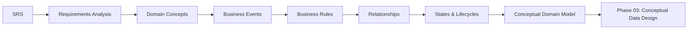

<div dir="rtl">

---

## 2. حدود هذه المرحلة

### داخل المرحلة

- تحديد مفاهيم المجال التجاري.
- تحديد الأحداث التجارية.
- تحديد العلاقات بين المفاهيم.
- تحديد التعددية المفاهيمية `Cardinality` عندما يسمح بها الـ SRS.
- توثيق قواعد العمل.
- تحليل حالات دورة الحياة.
- تحديد حدود المجالات الوظيفية.
- بناء النموذج المفاهيمي للمجال.
- ربط النموذج بالـ Requirements والـ Use Cases.
- تسجيل العناصر غير المحددة.

### خارج المرحلة

لا يتم في هذه المرحلة تحديد:

- جداول SQL.
- `Primary Keys`.
- `Foreign Keys`.
- أنواع البيانات.
- الفهارس.
- `Stored Procedures`.
- `Views`.
- `EF Core Entities`.
- `Migrations`.
- قرارات التخزين الفيزيائي.
- تحسينات DBMS محددة.

> **قاعدة أساسية:** وجود مفهوم في Domain Model لا يعني أنه أصبح جدولاً في قاعدة البيانات.

---

# 3. مصدر الحقيقة

المصدر الأساسي لهذه المرحلة هو الـ SRS.

المرحلة الثانية لا تضيف متطلبات تشغيلية جديدة، وإنما تقوم بتحويل المتطلبات المثبتة إلى نموذج مفاهيمي يمكن استخدامه لاحقاً في تصميم البيانات.

### تصنيف المعرفة

| التصنيف | المعنى |
|---|---|
| `SRS-DERIVED` | مذكور صراحة في الـ SRS |
| `DERIVED` | استنتاج مباشر وقابل للتتبع من متطلب أو Use Case |
| `UNSPECIFIED` | لم يحدد الـ SRS تفاصيله |
| `OPEN-ISSUE` | يحتاج إلى قرار أو توضيح |
| `DESIGN-DECISION` | قرار هندسي لاحق |

---

# 4. نموذج التفكير في المرحلة الثانية

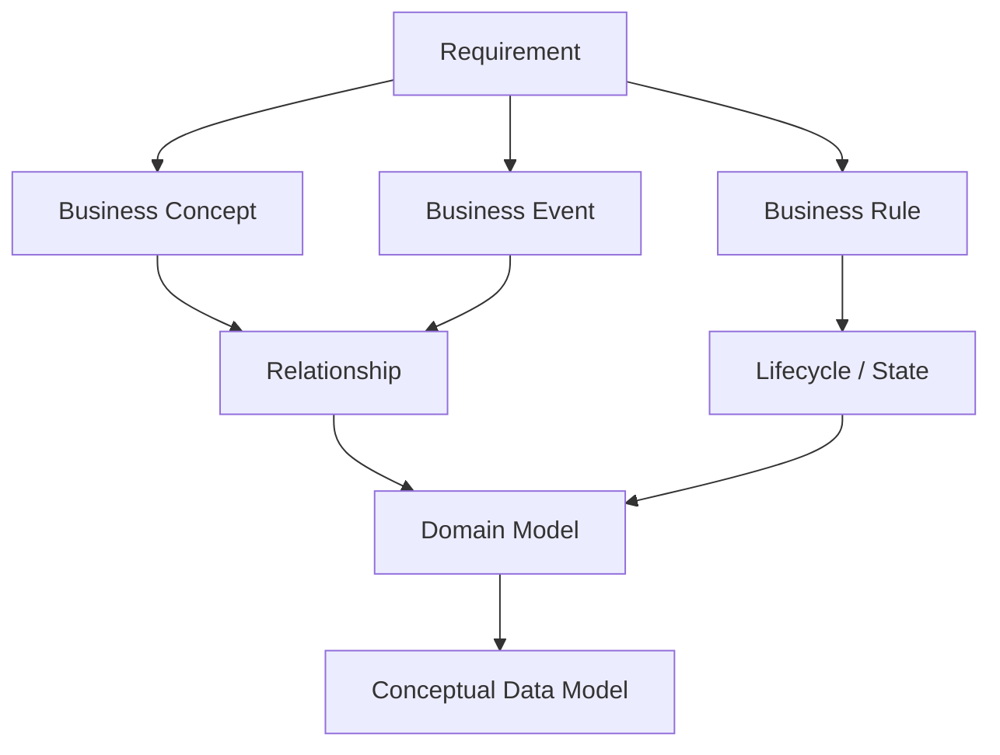

---

# 5. نطاق المجال

وفقاً للـ SRS، يمكن تقسيم المجال إلى ثمانية حدود رئيسية:

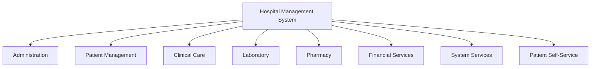

<div dir="rtl">

هذه الحدود **تنظيم مفاهيمي** وليست قراراً مسبقاً بأن كل حد يجب أن يصبح Microservice أو Database Schema أو Module مستقل.

---

# 6. Actors وعلاقتهم بالمجال

| Actor | المفاهيم والعمليات التي يتعامل معها حسب الـ SRS |
|---|---|
| Patient | المريض، المواعيد، التقارير، الفواتير، البوابة |
| Receptionist | التسجيل، المواعيد، الإدخال، النقل، الخروج |
| Doctor | السجل الطبي، التشخيص، الملاحظات، الوصفات، المختبر |
| Lab Technician | طلبات المختبر، المعالجة، التقارير |
| Pharmacist | الوصفات، صرف الأدوية، المخزون |
| Accountant | الفواتير، التأمين، المدفوعات، الإيصالات، التقارير |
| Admin | المستخدمون، الأدوار، الصلاحيات، الأطباء، الأقسام |
| Administrator | النسخ الاحتياطي، مراقبة صحة النظام |
| System | التحقق، الإشعارات، التنبيهات، العمليات الآلية |

---

# 7. Business Concepts

## 7.1 المفاهيم الأساسية المثبتة

| المفهوم | الحالة | المصدر |
|---|---|---|
| Patient | `SRS-DERIVED` | FR-08..FR-10 / UC-12..UC-17 |
| Doctor | `SRS-DERIVED` | FR-06 / FR-17..FR-22 |
| Department | `SRS-DERIVED` | FR-06..FR-07 |
| Appointment | `SRS-DERIVED` | FR-11..FR-13 |
| Prescription | `SRS-DERIVED` | FR-19 / FR-23..FR-24 |
| Medicine | `SRS-DERIVED` | FR-19 / FR-24..FR-26 |
| Diagnosis | `SRS-DERIVED` | FR-18 |
| Lab Request | `SRS-DERIVED` | FR-20..FR-21 |
| Lab Report | `SRS-DERIVED` | FR-21..FR-22 |
| Ward | `SRS-DERIVED` | FR-14..FR-15 |
| Bed | `SRS-DERIVED` | FR-14..FR-15 |
| Bill | `SRS-DERIVED` | FR-27..FR-30 |
| Payment | `SRS-DERIVED` | FR-29 |

## 7.2 مفاهيم مشتقة تحتاج نمذجة

| المفهوم | التصنيف | سبب ظهوره |
|---|---|---|
| Admission | `DERIVED` | UC-18 / UC-19 |
| Transfer | `DERIVED` | UC-20 |
| Discharge | `DERIVED` | UC-21 |
| Observation | `SRS-DERIVED` | FR-18 / UC-26 |
| Waitlist | `DERIVED` | FR-13 / UC-17 |
| Receipt | `DERIVED` | FR-29 / UC-42 |
| Notification | `DERIVED` | FR-22 / FR-33 / UC-47 |
| Insurance Information | `DERIVED` | FR-28 / UC-40 |
| Prescription Verification | `DERIVED` | FR-23 / UC-34 |
| Medicine Inventory | `DERIVED` | FR-24..FR-26 / UC-35..UC-38 |

> هذه المفاهيم لا تعني تلقائياً وجود Entity أو Table مستقل. القرار يأتي لاحقاً بعد تحليل دورة الحياة والبيانات.

---

# 8. Business Concepts Map

</div>

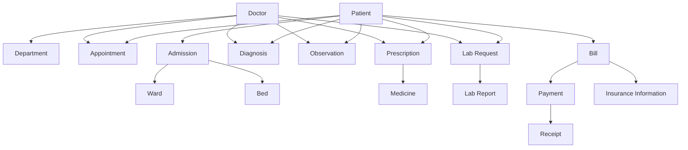

<div dir="rtl">

> الأسهم هنا تمثل علاقات مفاهيمية وليست Foreign Keys.

---

# 9. Business Events

الأحداث التجارية تمثل **شيئاً حدث داخل المجال** وله أثر على حالة النظام أو على سجل العمل.

## الأحداث الرئيسية

### إدارة المريض

- تسجيل مريض.
- تحديث بيانات المريض.
- حجز موعد.
- إلغاء موعد.
- إعادة جدولة موعد.
- إضافة المريض إلى قائمة الانتظار.

### الإقامة

- إدخال المريض.
- تعيين السرير.
- نقل المريض.
- إخراج المريض.

### الرعاية السريرية

- تسجيل التشخيص.
- تسجيل الملاحظات السريرية.
- إنشاء وصفة.

### المختبر

- إنشاء طلب فحص.
- بدء معالجة الفحص.
- إكمال الفحص.
- رفع التقرير.

### الصيدلية

- التحقق من الوصفة.
- وضع الوصفة للمراجعة.
- صرف الدواء.
- تحديث المخزون.
- ظهور تنبيه إعادة التخزين.
- تعليم دواء منتهي أو قريب الانتهاء.

### المالية

- إنشاء فاتورة.
- تطبيق التغطية التأمينية.
- تسجيل دفعة.
- إصدار إيصال.

### النظام

- إرسال إشعار.
- فشل إرسال إشعار.
- تنفيذ نسخة احتياطية.
- تسجيل نتيجة فحص صحة النظام.

---

# 10. Event Model

</div>

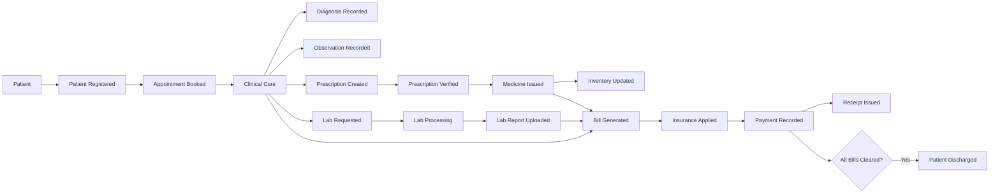

<div dir="rtl">

---

# 11. العلاقات المفاهيمية

## 11.1 Patient — Appointment — Doctor

المتطلبات تثبت أن المريض يحجز موعداً مع الطبيب، وأن النظام يتحقق من تعارض المواعيد.

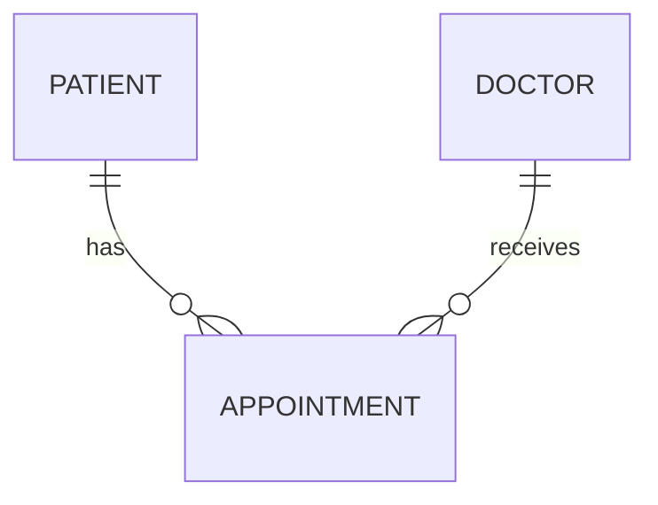

### ما نعرفه

- الموعد مرتبط بالمريض.
- الموعد مرتبط بالطبيب.
- النظام يفحص التعارضات.
- يمكن إلغاء الموعد أو إعادة جدولته.
- يوجد Token Number وفق UC-15.

### ما لا نعرفه بعد

- مدة الموعد.
- نموذج Schedule.
- ساعات عمل الطبيب.
- طريقة حساب التعارض.
- هل الموعد مرتبط بقسم مباشرة أم بالطبيب فقط.

---

# 12. Patient — Clinical Care

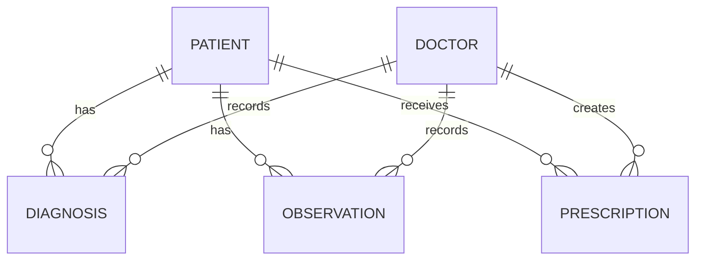

<div dir="rtl">

الـ SRS يثبت وجود التشخيص والملاحظات والوصفة، لكنه لا يحدد البنية الداخلية الكاملة لـ **Medical Record** أو **Visit/Encounter**.

لذلك لا يتم افتراض أن هذه المفاهيم متطابقة أو مختلفة في هذه المرحلة.

---

# 13. Patient — Laboratory

</div>

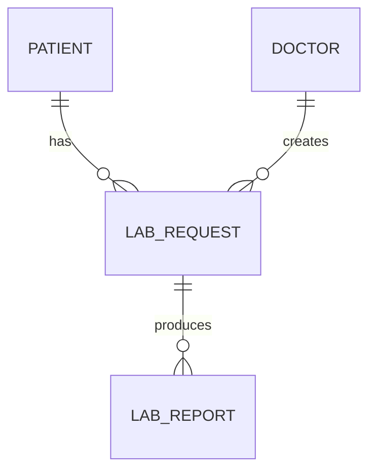

<div dir="rtl">

### القواعد المثبتة

- الطبيب يستطيع إنشاء طلب فحص.
- طلب الفحص يحتوي على نوع الفحص ومستوى الاستعجال والملاحظات السريرية.
- يمكن تحديد Test Parameters.
- الطلب يمر بالمعالجة.
- التقرير يرفع بعد المعالجة.
- التقرير يرتبط بالمريض والطبيب حسب UC-31.
- يتم إشعار الطبيب والمريض عند رفع التقرير.

### غير المحدد

- كتالوج الفحوصات.
- شكل Parameter.
- الوحدات.
- Reference Ranges.
- القيم الرقمية مقابل الملف المرفوع.
- تفاصيل إعادة الفحص.

---

# 14. Patient — Pharmacy

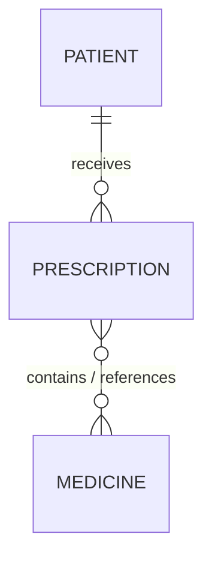

<div dir="rtl">

العلاقة بين الوصفة والدواء مثبتة وظيفياً، لكن الـ SRS لا يصف بشكل كامل بنية عناصر الوصفة.

لذلك:

`Prescription Item` = `DERIVED / REQUIRES VALIDATION`

ولا يجوز تثبيته كجدول نهائي قبل اعتماد النموذج.

---

# 15. Patient — Inpatient

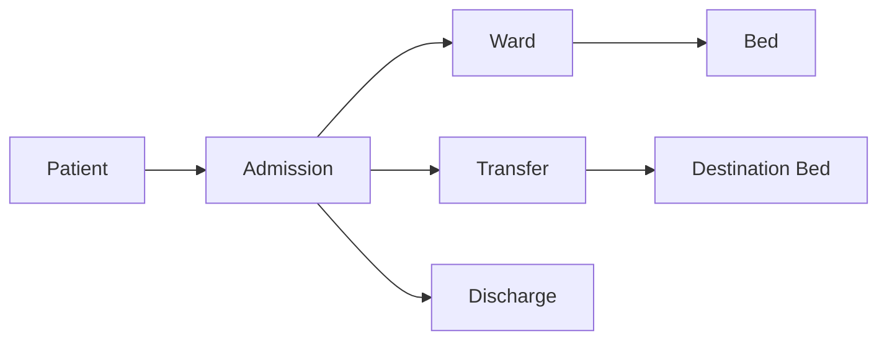

<div dir="rtl">

### القواعد

- المريض يجب أن يكون مسجلاً.
- يجب توفر سرير.
- عند النقل يجب توفر السرير الجديد.
- يتم تحرير السرير القديم.
- يتم تعيين السرير الجديد.
- يتم تسجيل التاريخ والوقت والسبب.
- الخروج يتطلب تسوية جميع الفواتير.
- يتم إنشاء ملخص خروج.

---

# 16. Patient — Finance

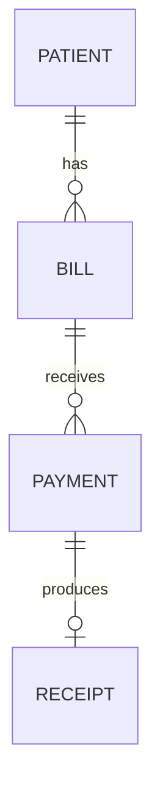

<div dir="rtl">

### القواعد المالية المثبتة

- الفاتورة مفصلة حسب الخدمات.
- يمكن تطبيق التغطية التأمينية.
- يمكن تسجيل دفعات جزئية.
- لا يجوز أن تتجاوز الدفعة الرصيد المستحق.
- إصدار الإيصال يتطلب وجود دفعة.
- الإيصال يحتوي على تاريخ الدفع والمبلغ والرصيد المتبقي.

### غير المحدد

الـ SRS لا يحدد:

- دليل الحسابات.
- القيود اليومية.
- General Ledger.
- الضرائب.
- الخصومات.
- العملات.
- المرتجعات.
- Credit Notes.
- قواعد التسعير المتقدمة.

لذلك لا يتم إدخال هذه المفاهيم في Domain Model كمتطلبات للنظام.

---

# 17. Business Rules

| ID | القاعدة | المصدر |
|---|---|---|
| BR-01 | لكل مريض معرف فريد | FR-09 |
| BR-02 | يجب فحص التكرار قبل تسجيل المريض | FR-08 / NFR-12 / UC-12 |
| BR-03 | يجب فحص تعارض الموعد قبل التأكيد | FR-12 |
| BR-04 | سبب الإلغاء أو إعادة الجدولة مطلوب | UC-16 |
| BR-05 | الإلغاء خلال ساعة يتطلب موافقة Admin | UC-16 |
| BR-06 | قائمة الانتظار First-Come-First-Served | UC-17 |
| BR-07 | الإدخال يتطلب توفر سرير | UC-18 |
| BR-08 | النقل يتطلب توفر السرير الوجهة | UC-20 |
| BR-09 | السرير القديم يتحرر عند النقل | UC-20 |
| BR-10 | النقل يسجل التاريخ والوقت والسبب | UC-20 |
| BR-11 | الخروج يتطلب تسوية جميع الفواتير | FR-16 / UC-21 |
| BR-12 | يتم إنشاء Discharge Summary عند الخروج | UC-21 |
| BR-13 | التشخيص يجب أن يكون مسجلاً قبل الوصفة للحالة الحالية | UC-27 |
| BR-14 | الوصفة ترسل إلى الصيدلية | UC-27 |
| BR-15 | عدم توفر الدواء يولد تنبيهاً للطبيب | UC-27 |
| BR-16 | طلب المختبر ينتقل من Pending إلى In Progress ثم Completed | UC-30 |
| BR-17 | التقرير يرتبط بطلب الفحص | UC-31 |
| BR-18 | لا يصرف الدواء قبل التحقق من الوصفة | UC-34 / UC-35 |
| BR-19 | الكمية السالبة للمخزون غير صالحة | UC-36 |
| BR-20 | التنبيه يظهر عند الوصول إلى Minimum Stock Threshold | UC-37 |
| BR-21 | الأدوية القريبة من الانتهاء يتم تعليمها | UC-38 |
| BR-22 | الفاتورة Itemized | UC-39 |
| BR-23 | الدفع الأكبر من Outstanding Balance مرفوض | UC-41 |
| BR-24 | Partial Payments مسموحة | UC-41 |
| BR-25 | Receipt يتطلب Payment | UC-42 |
| BR-26 | إشعار Lab Report يرسل للطبيب والمريض | UC-33 |
| BR-27 | إعادة محاولة الإشعار تصل إلى 3 مرات | UC-33 / UC-47 |
| BR-28 | المريض يصل إلى بياناته فقط في البوابة | UC-48..UC-50 |

---

# 18. Lifecycle Analysis

## Appointment

</div>

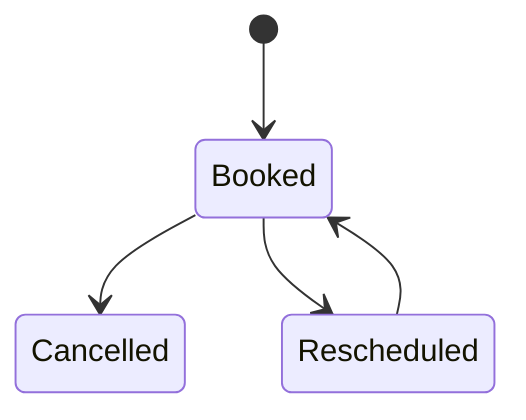

<div dir="rtl">

### الملاحظة

الـ SRS يثبت الحجز والإلغاء وإعادة الجدولة، لكنه لا يحدد كل حالات الموعد الممكنة.

لذلك لا نضيف حالات مثل:

`Completed`, `NoShow`, `PendingApproval`

إلا إذا تمت إضافتها رسمياً في المتطلبات.

---

## Laboratory Request

</div>

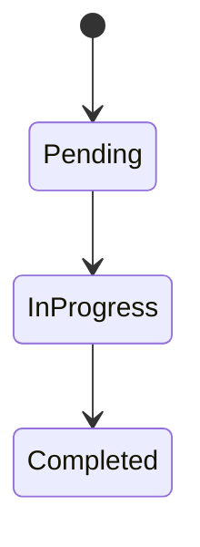

<div dir="rtl">

هذا التسلسل مذكور في UC-30.

---

## Prescription Verification

</div>

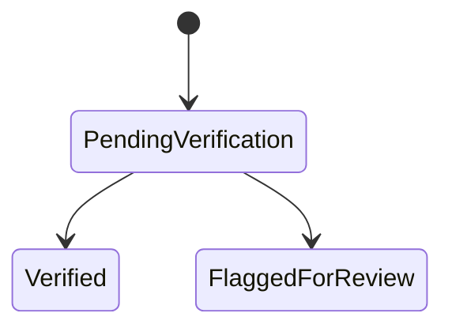

<div dir="rtl">

الحالتان `Verified` و`Flagged for Review` مثبتتان في UC-34.

---

## Patient Inpatient Status

</div>

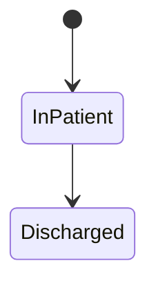

<div dir="rtl">

هذا يعكس الحالة المذكورة في UC-18 وUC-21، ولا يمثل دورة حياة المريض الكاملة.

---

# 19. Domain Boundaries

<div dir="ltr">

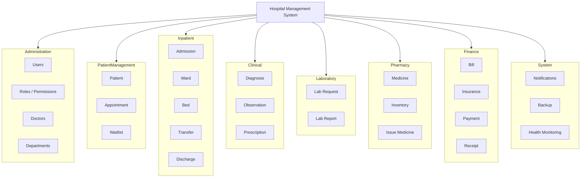

</div>

<div dir="rtl">

> هذه الحدود تساعدنا على التفكير في المجال. لا تعني أنها ستكون بالضرورة Microservices أو Schemas منفصلة.

---

# 20. Conceptual Domain Model

النموذج التالي هو **نموذج مجال مفاهيمي** وليس ERD نهائياً.

</div>

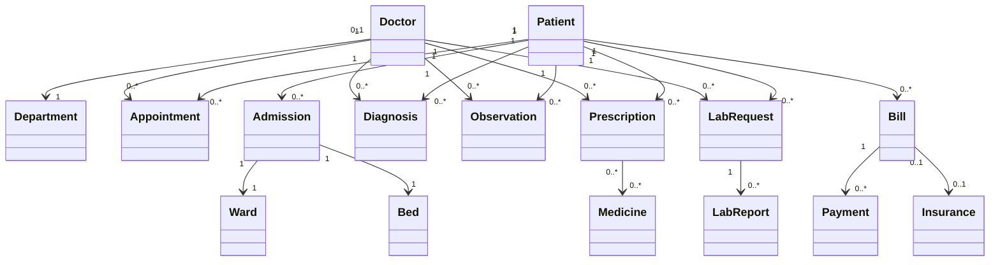

<div dir="rtl">

### تنبيه مهم حول Cardinality

القيم الموجودة في الرسم أعلاه تمثل **قراءة مفاهيمية أولية** مبنية على سلوك الـ SRS، وليست بعدُ قيوداً علائقية نهائية.

قبل تحويلها إلى Logical Model يجب مراجعتها مع:

- طبيعة الـ Visit / Encounter.
- دورة حياة Admission.
- طبيعة Prescription.
- طبيعة Lab Request.
- قواعد الفوترة.
- تعريف Doctor وStaff وUser.

---

# 21. Domain Invariants

الـ Invariant هو شرط يجب أن يبقى صحيحاً أثناء وجود الكيان أو العملية في المجال.

أمثلة مستخرجة من الـ SRS:

### Patient

```text
Patient ID must be unique.
```

### Appointment

```text
A confirmed appointment must not violate scheduling conflict rules.
```

### Inpatient

```text
Admission requires an available bed.
```

### Transfer

```text
Transfer requires an available destination bed.
```

### Discharge

```text
Discharge requires all bills to be cleared.
```

### Prescription

```text
Current visit diagnosis must exist before prescription creation.
```

### Inventory

```text
Medicine stock quantity cannot become negative.
```

### Payment

```text
Payment amount cannot exceed outstanding balance.
```

---

# 22. Domain Event → State Change

</div>

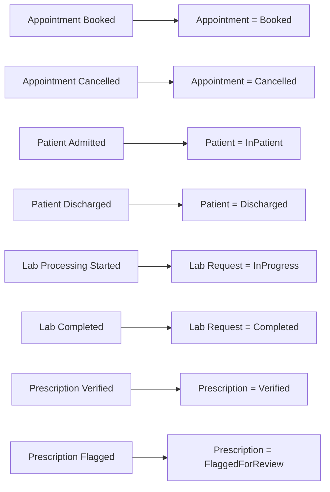

<div dir="rtl">

---

# 23. Traceability: Requirement → Domain

</div>

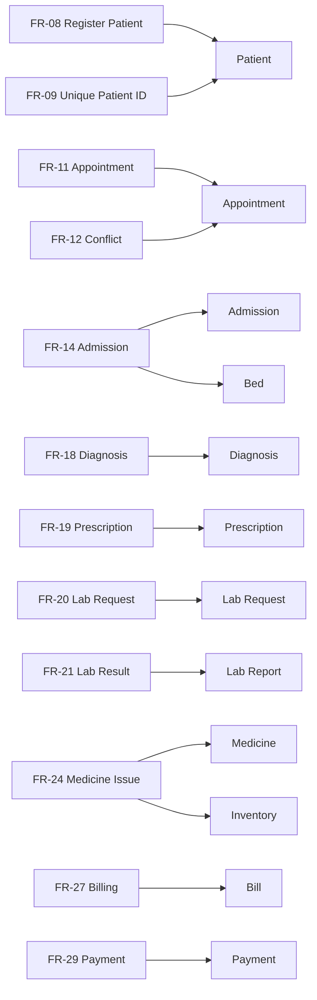

<div dir="rtl">

---

# 24. Traceability: Use Case → Event

| Use Case | Domain Event |
|---|---|
| UC-12 Register Patient | Patient Registered |
| UC-13 Update Patient | Patient Information Updated |
| UC-15 Book Appointment | Appointment Booked |
| UC-16 Cancel/Reschedule | Appointment Cancelled / Rescheduled |
| UC-17 Waitlist | Patient Added to Waitlist |
| UC-18 Admit Patient | Patient Admitted |
| UC-20 Transfer Patient | Patient Transferred |
| UC-21 Discharge | Patient Discharged |
| UC-25 Diagnose Patient | Diagnosis Recorded |
| UC-26 Record Observations | Observation Recorded |
| UC-27 Prescribe Medicine | Prescription Created |
| UC-28 Request Lab Test | Lab Requested |
| UC-30 Process Lab Test | Lab Processing |
| UC-31 Upload Lab Report | Lab Report Uploaded |
| UC-34 Verify Prescription | Prescription Verified / Flagged |
| UC-35 Issue Medicine | Medicine Issued |
| UC-39 Generate Bill | Bill Generated |
| UC-40 Apply Insurance | Insurance Applied |
| UC-41 Record Payment | Payment Recorded |
| UC-42 Issue Receipt | Receipt Issued |
| UC-47 Automated Notifications | Notification Sent |

---

# 25. Open Issues

هذه أهم النقاط التي يجب عدم تجاوزها إلى التصميم المنطقي دون قرار.

| # | الموضوع | الحالة |
|---|---|---|
| 01 | هل يوجد Visit/Encounter مستقل؟ | `OPEN-ISSUE` |
| 02 | ما العلاقة الدقيقة بين Medical Record وVisit؟ | `OPEN-ISSUE` |
| 03 | ما هي الحقول الكاملة للمريض؟ | `UNSPECIFIED` |
| 04 | ما هي مدة الموعد وSlot Model؟ | `UNSPECIFIED` |
| 05 | كيف يتم تعريف جدول عمل الطبيب؟ | `UNSPECIFIED` |
| 06 | هل يوجد Room داخل Ward؟ | `UNSPECIFIED` |
| 07 | ما الحالات الكاملة للسرير؟ | `UNSPECIFIED` |
| 08 | ما البنية الداخلية للإقامة؟ | `UNSPECIFIED` |
| 09 | هل يوجد Coding Standard للتشخيص؟ | `UNSPECIFIED` |
| 10 | ما أنواع الملاحظات والـ Vitals ووحداتها؟ | `UNSPECIFIED` |
| 11 | ما بنية Prescription Items؟ | `OPEN-ISSUE` |
| 12 | ما كتالوج الفحوصات؟ | `UNSPECIFIED` |
| 13 | ما Reference Ranges للمختبر؟ | `UNSPECIFIED` |
| 14 | هل المخزون يعتمد على Batch/Lot؟ | `UNSPECIFIED` |
| 15 | هل توجد مواقع متعددة للمخزون؟ | `UNSPECIFIED` |
| 16 | ما تفاصيل التأمين والتغطية؟ | `UNSPECIFIED` |
| 17 | ما طرق الدفع؟ | `UNSPECIFIED` |
| 18 | هل توجد ضرائب أو خصومات؟ | `UNSPECIFIED` |
| 19 | هل توجد Refunds؟ | `UNSPECIFIED / Not stated` |
| 20 | هل توجد مشتريات وموردون؟ | `UNSPECIFIED / Not stated` |
| 21 | هل يوجد General Ledger؟ | `UNSPECIFIED / Not stated` |
| 22 | العلاقة بين User وStaff وDoctor؟ | `OPEN-ISSUE` |

---

# 26. What We Must NOT Assume

في هذه المرحلة لا نفترض مثلاً:

```text
Patient
 ├── FirstName
 ├── LastName
 ├── DateOfBirth
 ├── Phone
 └── Address
```

لمجرد أن هذه الحقول شائعة في أنظمة المستشفيات.

كذلك لا نفترض:

```text
Prescription
 └── PrescriptionItems
       └── Medicine
```

كحقيقة نهائية لمجرد أن هذا تصميم شائع.

ولا نفترض:

```text
Bill
 └── InvoiceLines
       └── Service
```

ولا:

```text
Patient
 └── Encounter
       ├── Diagnosis
       ├── Observation
       └── Prescription
```

إلا بعد أن يتم إثبات الحاجة إليها وتحليلها واعتمادها.

---

# 27. Domain Model vs Database Model

| Domain Modeling | Database Modeling |
|---|---|
| Patient | Patient Table |
| Appointment | Appointment Table |
| Payment Event | Payment Table |
| Business Rule | Constraint / Application Rule |
| Relationship | PK/FK Relationship |
| Lifecycle | Status / State representation |
| Business Event | Transactional Record |
| Domain Boundary | Module / Schema / Context |

> العلاقة بين العمودين ليست 1:1.

قد ينتج عن مفهوم واحد أكثر من جدول، وقد تتحد عدة مفاهيم في بنية واحدة، وقد يوجد مفهوم تجاري لا يحتاج إلى Table مستقل.

---

# 28. Phase 02 Quality Gate

قبل الانتقال إلى Phase 03 يجب أن نستطيع الإجابة عن الأسئلة التالية:

- ما هي مفاهيم المجال؟
- ما هي الأحداث؟
- ما هي العلاقات؟
- ما هي القواعد؟
- ما هي حالات دورة الحياة؟
- ما هي حدود المجالات؟
- ما العلاقات التي يمكن إثباتها من الـ SRS؟
- ما العلاقات التي ما زالت تحتاج قراراً؟
- ما المفاهيم التي لا نعرف تفاصيلها بعد؟
- هل تم منع أي افتراض غير موثق من التحول إلى حقيقة؟

</div>

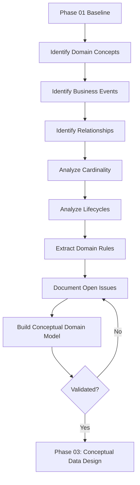

<div dir="rtl">

---

# 29. Definition of Done

تعتبر Phase 02 مكتملة عندما:

- [x] تم تحديد نطاق المجال.
- [x] تم تحديد Business Concepts.
- [x] تم تحديد Business Events.
- [x] تم توثيق العلاقات المفاهيمية.
- [x] تم تحليل Cardinality الأولية.
- [x] تم توثيق Business Rules.
- [x] تم تحليل الحالات الأساسية.
- [x] تم تحديد Domain Boundaries.
- [x] تم بناء Conceptual Domain Model.
- [x] تم ربط المفاهيم بالـ Requirements.
- [x] تم ربط Use Cases بالأحداث.
- [x] تم توثيق Open Issues.
- [x] لم يتم إنشاء SQL Schema.
- [x] لم يتم افتراض حقول غير موثقة.
- [x] لم يتم اعتبار كل Domain Concept جدولاً.

---

# 30. Transition to Phase 03

المرحلة التالية هي:

```text
Phase 03
Conceptual Data Design
```

وسيكون هدفها تحويل النموذج المفاهيمي إلى **Conceptual Data Model / ERD** أكثر دقة.

المسار:

```mermaid
flowchart LR
    A["Phase 01
    Requirements"] --> B["Phase 02
    Domain Model"]
    B --> C["Phase 03
    Conceptual Data Model"]
    C --> D["Phase 04
    Logical Data Model"]
    D --> E["Phase 05
    Physical Design"]
    E --> F["Phase 06
    Implementation"]
```

<div dir="rtl">

### قاعدة الانتقال

لا ننتقل إلى Phase 03 لمجرد أن لدينا أسماء Entities.

ننتقل لأننا أصبحنا قادرين على تفسير:

> **لماذا يوجد هذا المفهوم؟ ما الحدث الذي ينشئه؟ ما القواعد التي تحكمه؟ ما المفاهيم التي يرتبط بها؟ وما الذي يثبت هذه العلاقة في الـ SRS؟**

---

# 31. الخلاصة

المرحلة الثانية تنقل المشروع من:

> **ماذا يريد النظام؟**

إلى:

> **ما العالم التجاري الذي يمثله النظام؟**

وبالتالي يصبح المسار:

```text
Requirements
      ↓
Business Understanding
      ↓
Domain Concepts
      ↓
Business Events
      ↓
Business Rules
      ↓
Relationships
      ↓
States
      ↓
Domain Model
      ↓
Conceptual Data Model
```

## المبدأ المركزي

> **لا نبدأ بتصميم قاعدة البيانات لأننا نعرف SQL؛ نبدأ بفهم المجال الذي ستقوم قاعدة البيانات بتمثيله.**

وأي عنصر لم يثبته الـ SRS أو لم يمكن تتبعه بشكل واضح يبقى:

`UNSPECIFIED → OPEN-ISSUE → DECISION → MODEL`

وليس:

`ASSUMPTION → TABLE`

</div>
